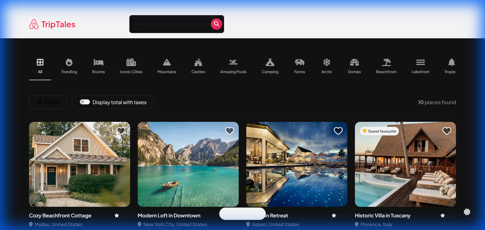
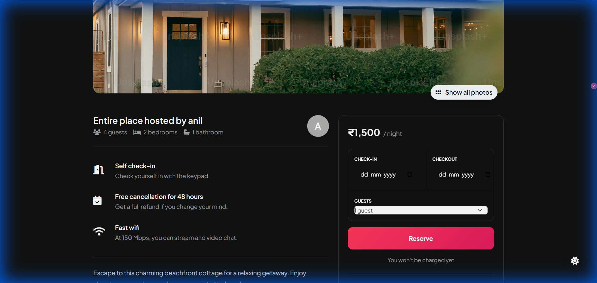
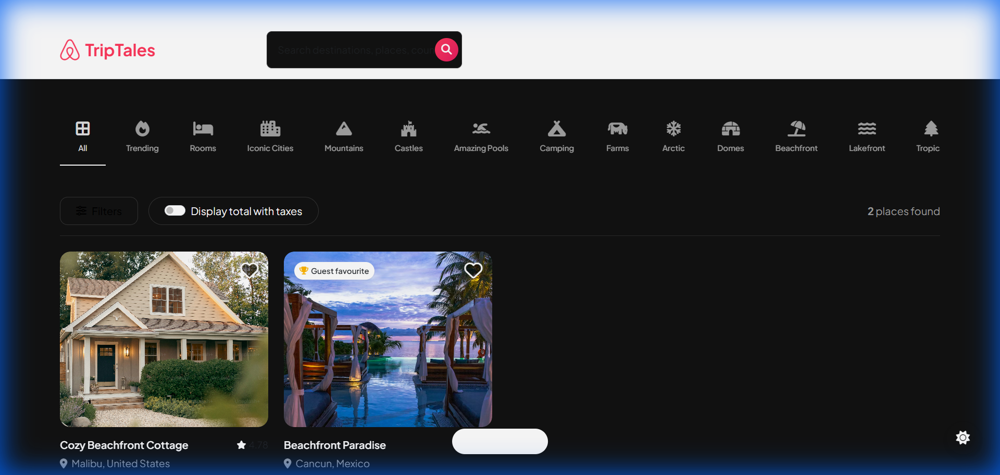
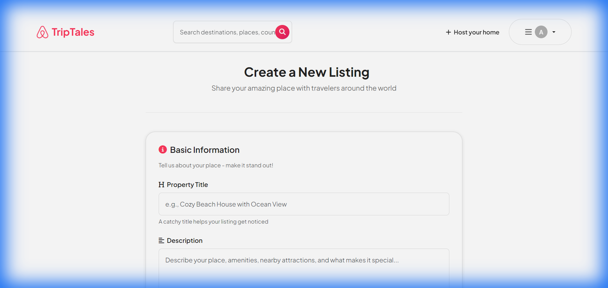

# 🏠 TripTales - Airbnb Clone

A full-featured vacation rental platform inspired by Airbnb, built with Node.js, Express, MongoDB, and modern web technologies. TripTales allows users to discover unique places to stay, create their own listings, and manage bookings seamlessly.

[](https://triptales-8b6r.onrender.com/listings)
[](https://nodejs.org/)
[](https://expressjs.com/)
[](https://www.mongodb.com/)

## 🌟 Live Demo

**[Visit TripTales Live →](https://triptales-8b6r.onrender.com/listings)**

## 📸 Screenshots

### Homepage - Discover Amazing Places

*Browse through curated listings with beautiful property cards*

### Listing Details

*Comprehensive property information with amenities, pricing, and booking options*

### Search Functionality

*Real-time search filtering by location, property type, and amenities*

### Create New Listing

*Intuitive form to add new properties with image upload and detailed information*

## ✨ Features

### 🏡 Property Management
- **Browse Listings** - Explore a diverse collection of vacation rentals with high-quality images
- **Detailed Property Views** - View comprehensive information including amenities, pricing, location, and host details
- **Create Listings** - Host your own property with an easy-to-use listing creation form
- **Edit & Delete** - Full CRUD operations for managing your properties
- **Image Upload** - Upload property photos with drag-and-drop support (Cloudinary integration)

### 🔍 Search & Discovery
- **Real-time Search** - Instantly search listings by destination, title, or description
- **Category Filters** - Filter properties by type (Trending, Beachfront, Rooms, Mountains, Pools, etc.)
- **Advanced Filtering** - Search by location, price range, amenities, and more
- **Smart Results** - Get relevant results with case-insensitive search

### 👤 User Authentication & Authorization
- **Secure Authentication** - Login and signup with password hashing (bcrypt)
- **Session Management** - Persistent user sessions with express-session
- **Authorization** - Role-based access control for listing management
- **User Profiles** - Personalized user accounts and profile management

### 🎨 Modern UI/UX
- **Responsive Design** - Fully responsive layout that works on all devices
- **Smooth Animations** - Engaging micro-animations and hover effects
- **Modern Aesthetics** - Clean, professional design with gradient accents
- **Interactive Elements** - Dynamic cards with favorite/like functionality
- **Icon Integration** - Beautiful icons using Font Awesome

### 📱 Additional Features
- **Flash Messages** - User-friendly notifications for actions (using connect-flash)
- **Form Validation** - Client and server-side validation with Joi
- **Error Handling** - Comprehensive error handling with custom error pages
- **MVC Architecture** - Clean, maintainable code structure
- **RESTful API** - Well-structured API endpoints

## 🛠️ Technologies Used

### Backend
- **Node.js** - JavaScript runtime environment
- **Express.js** - Web application framework
- **MongoDB** - NoSQL database for storing listings and user data
- **Mongoose** - MongoDB object modeling
- **Passport.js** - Authentication middleware
- **express-session** - Session management
- **bcrypt** - Password hashing

### Frontend
- **EJS** - Embedded JavaScript templating
- **Vanilla CSS** - Custom styling with modern design patterns
- **JavaScript** - Client-side interactivity
- **Font Awesome** - Icon library
- **Google Fonts** - Custom typography (Inter, Roboto)

### Additional Tools
- **Cloudinary** - Image hosting and management
- **Joi** - Schema validation
- **connect-flash** - Flash messages
- **method-override** - HTTP method override
- **dotenv** - Environment variable management

## 📋 Prerequisites

Before running this project, make sure you have:

- **Node.js** (v14 or higher) installed
- **MongoDB** Atlas account or local MongoDB installation
- **Cloudinary** account for image uploads
- **Git** for version control

## 🚀 Installation & Setup

### 1. Clone the Repository
```bash
git clone https://github.com/yourusername/triptales-airbnb-replica.git
cd triptales-airbnb-replica
```

### 2. Install Dependencies
```bash
npm install
```

### 3. Environment Variables
Create a `.env` file in the root directory and add the following:

```env
# MongoDB Connection
MONGO_URL=your_mongodb_connection_string
ATLAS_DB_URL=your_mongodb_atlas_url

# Cloudinary Configuration
CLOUD_NAME=your_cloudinary_cloud_name
CLOUD_API_KEY=your_cloudinary_api_key
CLOUD_API_SECRET=your_cloudinary_api_secret

# Session Secret
SESSION_SECRET=your_secret_key_here

# Server Configuration
PORT=8080
```

### 4. Database Setup
The application will automatically create the necessary collections. You can also seed initial data:

```bash
node init/index.js
```

### 5. Run the Application

**Development Mode:**
```bash
npm start
```
or
```bash
node app.js
```

The application will be available at `http://localhost:8080`

**Production Mode:**
Configure your hosting platform (Render, Heroku, etc.) with the environment variables and run:
```bash
npm start
```

## 📁 Project Structure

```
triptales-airbnb-replica/
├── controllers/          # Route controllers (MVC)
│   ├── listing.js       # Listing-related logic
│   └── user.js          # User authentication logic
├── models/              # Database models
│   ├── listing.js       # Listing schema
│   └── user.js          # User schema
├── routes/              # Express routes
│   ├── listing.js       # Listing routes
│   └── user.js          # User routes
├── views/               # EJS templates
│   ├── layouts/         # Layout templates
│   ├── listings/        # Listing views
│   ├── users/           # User views
│   └── includes/        # Reusable components
├── public/              # Static files
│   ├── css/            # Stylesheets
│   ├── js/             # Client-side scripts
│   └── images/         # Static images
├── init/               # Database initialization
│   ├── data.js         # Sample data
│   └── index.js        # Seed script
├── middleware/         # Custom middleware
│   └── auth.js         # Authentication middleware
├── utils/              # Utility functions
│   ├── cloudinary.js   # Cloudinary configuration
│   └── ExpressError.js # Custom error class
├── app.js              # Main application file
├── package.json        # Dependencies
└── .env                # Environment variables
```

## 🎯 API Endpoints

### Listings
- `GET /listings` - Get all listings
- `GET /listings/new` - Show create listing form
- `POST /listings` - Create a new listing
- `GET /listings/:id` - Get a specific listing
- `GET /listings/:id/edit` - Show edit listing form
- `PUT /listings/:id` - Update a listing
- `DELETE /listings/:id` - Delete a listing
- `GET /listings/search` - Search listings

### Users
- `GET /signup` - Show signup form
- `POST /signup` - Register a new user
- `GET /login` - Show login form
- `POST /login` - Authenticate user
- `GET /logout` - Logout user

## 🔐 Security Features

- **Password Encryption** - Bcrypt hashing for secure password storage
- **Session Management** - Secure session handling with express-session
- **CSRF Protection** - Protection against cross-site request forgery
- **Input Validation** - Server-side validation using Joi
- **Authorization Checks** - Middleware for route protection
- **Environment Variables** - Sensitive data stored in .env files

## 🎨 Design Features

- **Modern Color Palette** - Carefully curated HSL colors for a premium feel
- **Gradient Accents** - Smooth gradients for visual appeal
- **Micro-animations** - Subtle hover effects and transitions
- **Glass morphism** - Modern frosted glass effects
- **Typography** - Professional fonts (Inter, Roboto)
- **Responsive Grid** - CSS Grid and Flexbox layouts
- **Dark Mode Support** - Toggle between light and dark themes (if implemented)

## 🚀 Deployment

This application is deployed on **Render**. To deploy your own instance:

### Render Deployment
1. Create a new Web Service on Render
2. Connect your GitHub repository
3. Set environment variables in Render dashboard
4. Deploy with the following settings:
   - **Build Command**: `npm install`
   - **Start Command**: `node app.js`
   - **Environment**: Node

### Alternative Deployment Options
- **Heroku** - Easy deployment with Git integration
- **Railway** - Modern deployment platform
- **DigitalOcean** - Full server control
- **AWS** - Enterprise-grade hosting

## 🤝 Contributing

Contributions are welcome! Please follow these steps:

1. Fork the repository
2. Create a feature branch (`git checkout -b feature/AmazingFeature`)
3. Commit your changes (`git commit -m 'Add some AmazingFeature'`)
4. Push to the branch (`git push origin feature/AmazingFeature`)
5. Open a Pull Request

## 📝 License

This project is licensed under the MIT License - see the [LICENSE](LICENSE) file for details.

## 👨‍💻 Author

**Siddem Anil Kumar**

- GitHub: [@Anil2995](https://github.com/Anil2995)
- LinkedIn: [Your LinkedIn Profile](https://www.linkedin.com/in/yourprofile)
- Portfolio: [Your Portfolio Website](https://yourportfolio.com)

## 🙏 Acknowledgments

- Inspired by [Airbnb](https://www.airbnb.com/)
- Icons from [Font Awesome](https://fontawesome.com/)
- Hosted on [Render](https://render.com/)
- Image hosting by [Cloudinary](https://cloudinary.com/)

## 📞 Support

If you have any questions or need help, feel free to:
- Open an issue on GitHub
- Contact me via email
- Connect on LinkedIn

---

⭐ **If you found this project helpful, please give it a star!** ⭐

